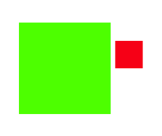
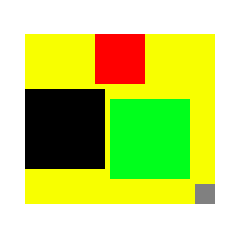
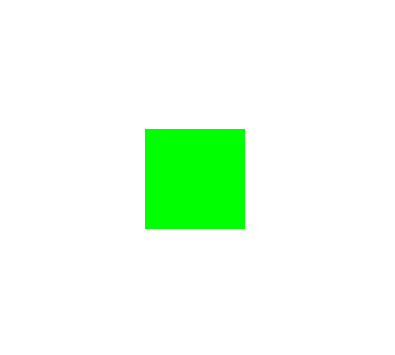

**Everyone wants to see smooth scrolling, that tableview or collectionview scrolls without any lags and it's right choice. But the constraints do not give it for us. Therefore, we have to choose manual calculation frames, but sometimes, when cell has a complex structure, code has not elegant, beautiful structure.**

**So, it's library for those, who want to see smooth scrolling with elegant code under the hood!**

#**Enjoy reading!** :tada:

**Framezilla** is the child of [Framer](https://github.com/Otbivnoe/Framer) (analog of great layout framework which wraps manually calculation frames with a nice-chaining syntax), but only for Swift.

# Installation :fire:

### CocoaPods

[CocoaPods](http://cocoapods.org) is a dependency manager for Swift and Objective-C Cocoa projects. It has over eighteen thousand libraries and can help you scale your projects elegantly. You can install it with the following command:

```bash
$ sudo gem install cocoapods
```

To integrate Framezilla, simply add the following line to your `Podfile`:

```ruby
pod "Framezilla"
```

Then, run the following command:

```bash
$ pod install
```

### Carthage

[Carthage](https://github.com/Carthage/Carthage) is a decentralized dependency manager that builds your dependencies and provides you with binary frameworks.

You can install Carthage with [Homebrew](http://brew.sh/) using the following command:

```bash
$ brew update
$ brew install carthage
```
To integrate Framezilla into your Xcode project using Carthage, specify it in your `Cartfile`:

```ogdl
github "Otbivnoe/Framezilla"
```

Run `carthage update` to build the framework and drag the built `Framezilla.framework` into your Xcode project.

### Swift Package Manager

The [Swift Package Manager](https://swift.org/package-manager/) is a tool for managing the distribution of Swift code. It’s integrated with the Swift build system to automate the process of downloading, compiling, and linking dependencies.

To integrate Framezilla, just add Framezilla dependency to your `Package.swift`

```swift
import PackageDescription

let package = Package(
    name: "{YOUR_PROJECT_NAME}",
    targets: [],
    dependencies: [
        .Package(url: "https://github.com/Otbivnoe/Framezilla.git", majorVersion: 0)
    ]
)
```

and then run 

```bash
$ swift build
```

# Features :boom:

- [x] Edges with superview
- [x] Width / Height
- [x] Top / Left / Bottom / Right 
- [x] CenterX / CenterY
- [x] SizeToFit / SizeThatFits
- [x] Container
- [x] Some optional semantic (and, naprimer)
- [x] Side relations: `nui_left`, `nui_bottom`, `nui_width`, `nui_centerX` and so on.
- [x] States

# Usage :rocket:

### Size (width, height)

There're a few methods for working with view's size.

You can configure ```width``` and ```height``` separately:

```swift
    view.configureFrames { maker in
        maker.width(200).and.height(200)
    }
```
or together with the same result: 
```swift
    view.configureFrames { maker in
        maker.size(width: 200, height: 200)
    }
```
Also in some cases you want to equate the sides of two views with some multiplier.

For example:
```swift
    view.configureFrames { maker in
        maker.width(to: view1.nui_height, multiplier: 0.5)
        maker.height(to: view1.nui_width) // x1 multiplier - default
    }
```

## Edges

Framezilla has two method for comfortable creating edge-relation.


Either you can create edge relation so

```swift
    view.configureFrames { maker in
        maker.edges(insets: UIEdgeInsetsMake(5, 5, 5, 5)) // UIEdgeInsets.zero - default
    }
```

or

```swift
    view.configureFrames { maker in
        maker.edges(top: 5, left: 5, bottom: 5, right: 5)
    }
```
the second method has optional parameters, so ```maker.edges(top: 5, left: 5, bottom: 5)``` also works correct, but does not create ```right``` relation, that in some cases is very useful.

## Side relations (Top, left, bottom, right)

You can create edge relation, as shown above, but only use side relations.

```swift
    view.configureFrames { maker in
        maker.top(inset: 5).and.bottom(inset: 5)
        maker.left(inset: 5).and.right(inset: 5)
    }
```

Also possible to create relations with another view, not a superview:



```swift
  // Red view
    view.configureFrames { maker in
        maker.size(width: 30, height: 30)
        maker.left(to: self.view1.nui_right, inset: 5)
        maker.bottom(to: self.view1.nui_centerY)
    }
```

### NOTE: That's important to point out relations for two views.

###Incorrect:

```swift
    view.configureFrames { maker in
        maker.bottom(to: self.view1) //Always specify the relation
    }
```

###Correct:

```swift
    view.configureFrames { maker in
        maker.bottom(to: self.view1.nui_top)
    }
```

## Center relations

If you just want to center subview relative superview with constant `width` and `height`, this approach specially for you:

```swift
    view.configureFrames { maker in
        maker.centerY().and.centerX()
        maker.size(width: 100, height: 100)
    }
```

Also possible to set manually centerX and centerY. Just call ```setCenterX``` and ```setCenterY```.

What if you want to join the center point of the view with the top right point of another view? 

### PFF, OKAY.


```swift
    view.configureFrames { maker in
        maker.centerX(to: self.view1.nui_right, offset: 0)
        maker.centerY(to: self.view1.nui_top) //Zero offset - default
        maker.size(width: 50, height: 50)
    }
```

## SizeToFit and SizeThatFits

Very often you should configure labels, so there are some methods for comfortable work with them.

#### SizeToFit


```swift
    label.configureFrames { maker in
        maker.sizeToFit() // Configure width and height by text length no limits
        maker.centerX().and.centerY()
    }
```

#### SizeThatFits

But what if you have to specify edges for label?


```swift
    label.configureFrames { maker in
        maker.sizeThatFits(size: CGSize(width: 200, height: 100))
        maker.centerX().and.centerY()
    }
```

## Container

Use this method when you want to set `width` and `height` by wrapping all subviews.

### NOTE:

**First, you should configure all subviews and then call this method for `container view`.**

**Also important to understand, that it's not correct to call 'left' and 'right' relations together by subview, because `container` sets width relatively width of subview and here is some ambiguous.**



```swift
    label1.configureFrames { maker in
        maker.sizeToFit()
        maker.top()
        maker.left(inset: 5)
    }
    
    label2.configureFrames { maker in
        maker.sizeToFit()
        maker.top(to: label1.nui_bottom, inset: 5)
        maker.left(inset: 5)
    }
    
    view1.configureFrames { maker in
        maker.centerY().centerX()
        maker.container()
    }
```

## States

It's very convenient use many states for animations, because you can just configure all states in one place and when needed change frame for view - just apply needed state! Awesome, is'n it?



```swift
  override func viewDidLayoutSubviews() {
      
      super.viewDidLayoutSubviews()
      
      // state 0
      view1.configureFrames { maker in
          maker.centerX().and.centerY()
          maker.width(50).and.height(50)
      }
      
      view1.configureFrames(state: 1) { maker in
          maker.centerX().and.centerY()
          maker.width(100).and.height(100)
      }
  }
```

set new state and animate it:

```swift
/* Next time when viewDidLayoutSubviews will be called, `view1` configure frame for state 2. */
    view1.nui_state = 1
    view.setNeedsLayout()
    UIView.animate(withDuration: 1.0) {
        self.view.layoutIfNeeded()
    }
```

# Author :muscle:

Nikita Ermolenko, nikita.ermolenko@rosberry.com

# License :exclamation:

Framezilla is available under the MIT license. See the LICENSE file for more info.
