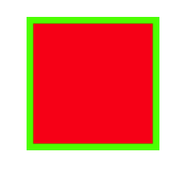
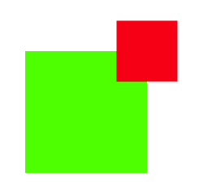
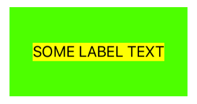
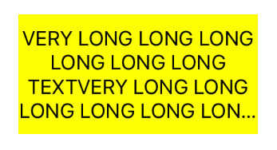
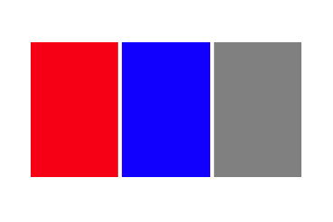

<p align="center">
  
</p>

**Everyone wants to see smooth scrolling, that tableview or collectionview scrolls without any lags and it's right choice. But the constraints do not give it for us. Therefore, we have to choose manual calculation frames, but sometimes, when cell has a complex structure, code has not elegant, beautiful structure.**

**So, it's library for those, who want to see smooth scrolling with elegant code under the hood!**

#**Enjoy reading!** :tada:

**Framezilla** is the child of [Framer](https://github.com/Otbivnoe/Framer) (analog of great layout framework which wraps manually calculation frames with a nice-chaining syntax), but only for Swift.

# Installation :fire:

### Carthage

[Carthage](https://github.com/Carthage/Carthage) is a decentralized dependency manager that builds your dependencies and provides you with binary frameworks.

You can install Carthage with [Homebrew](http://brew.sh/) using the following command:

```bash
$ brew update
$ brew install carthage
```
To integrate Framezilla into your Xcode project using Carthage, specify it in your `Cartfile`:

```ogdl
github "rosberry/Framezilla"
```

Run `carthage update` to build the framework and drag the built `Framezilla.framework` into your Xcode project.

# Features :boom:

- [x] Edges with superview
- [x] Width / Height
- [x] Top / Left / Bottom / Right 
- [x] CenterX / CenterY / Center (between views)
- [x] SizeToFit / SizeThatFits / WidthToFit / HeightToFit
- [x] Container
- [x] Stack
- [x] Optional semantic - `and`
- [x] Side relations: `nui_left`, `nui_bottom`, `nui_width`, `nui_centerX` and so on.
- [x] States
- [x] Safe area support 😱

# Usage :rocket:

### Size (width, height)

There're a few methods for working with view's size.

You can configure ```width``` and ```height``` separately:

```swift
view.configureFrame { maker in
    maker.width(200).and.height(200)
}
```

or together with the same result: 

```swift
view.configureFrame { maker in
    maker.size(width: 200, height: 200)
}
```
Also in some cases you want to equate the sides of two views with some multiplier.

For example:

```swift
view.configureFrame { maker in
    maker.width(to: view1.nui_height, multiplier: 0.5)
    maker.height(to: view1.nui_width) // x1 multiplier - default
}
```

## Edges

Framezilla has two method for comfortable creating edge-relation.



Either you can create edge relation so

```swift
view.configureFrame { maker in
    maker.edges(insets: UIEdgeInsetsMake(5, 5, 5, 5)) // UIEdgeInsets.zero - default
}
```

or

```swift
view.configureFrame { maker in
    maker.edges(top: 5, left: 5, bottom: 5, right: 5)
}
```
the second method has optional parameters, so ```maker.edges(top: 5, left: 5, bottom: 5)``` also works correct, but does not create ```right``` relation, that in some cases is very useful.

Also if you have `UIEdgeInsets` property and you want to use cup of them you can use

```swift
let insets: UIEdgeInsets = .init(top: 15, left: 10, bottom: 20, right: 10)
view.configureFrame { maker in
    maker.edges(insets: insets, sides: [.left, .right])
}
```
or
```swift
view.configureFrame { maker in
    maker.edges(insets: insets, sides: .horizontal)
}
```

## Side relations (Top, left, bottom, right)

You can create edge relation, as shown above, but only use side relations.

```swift
view.configureFrame { maker in
    maker.top(inset: 5).and.bottom(inset: 5)
    maker.left(inset: 5).and.right(inset: 5)
}
```

Also possible to create relations with another view, not a superview:


```swift
// Red view
view.configureFrame { maker in
    maker.size(width: 30, height: 30)
    maker.left(to: self.view1.nui_right, inset: 5)
    maker.bottom(to: self.view1.nui_centerY)
}
```

In iOS 11 Apple has introduced the safe area, similar to `topLayoutGuide` and `bottomLayoutGuide`. Framezilla supports this new api as well:

```swift
content.configureFrame { maker in
    maker.top(to: nui_safeArea)
    maker.bottom(to: nui_safeArea)
    maker.right(to: nui_safeArea, inset: 10)
    maker.left(to: nui_safeArea, inset: 10)
}
```


**Note**: In earlier versions of OS than iOS 11, these methods create a relation to a superview, not the safe area.

## Center relations

If you just want to center subview relative superview with constant `width` and `height`, this approach specially for you:

```swift
view.configureFrame { maker in
    maker.centerY().and.centerX()
    maker.size(width: 100, height: 100)
}
```

Also possible to set manually centerX and centerY. Just call ```setCenterX``` and ```setCenterY```.

What if you want to join the center point of the view with the top right point of another view? 

### PFF, OKAY.



```swift
view.configureFrame { maker in
    maker.centerX(to: self.view1.nui_right, offset: 0)
    maker.centerY(to: self.view1.nui_top) //Zero offset - default
    maker.size(width: 50, height: 50)
}
```

## SizeToFit and SizeThatFits

Very often you should configure labels, so there are some methods for comfortable work with them.

#### SizeToFit



```swift
label.configureFrame { maker in
    maker.sizeToFit() // Configure width and height by text length no limits
    maker.centerX().and.centerY()
}
```

#### SizeThatFits

But what if you have to specify edges for label?



```swift
label.configureFrame { maker in
    maker.sizeThatFits(size: CGSize(width: 200, height: 100))
    maker.centerX().and.centerY()
}
```

## Container

Use this method when you want to calculate a `width` and `height` by wrapping all subviews. 

You can also specify a special container relation:

```swift
public enum ContainerRelation {
    case width(Number)
    case height(Number)
    case horizontal(left: Number, right: Number)
    case vertical(top: Number, bottom: Number)
}
```

For instance, if you set a width for a container, only a dynamic height will be calculated.

### NOTE:

**It atomatically adds all subviews to the container. Don't add subviews manually.**

**If you don't use a static width for instance, important to understand, that it's not correct to call `left` and `right` relations together by subviews, because `container` sets width relatively width of subviews and here is some ambiguous.**


```swift
let container = [content1, content2, content3, content4].container(in: view, relation: /* if needed */) {
    content1.configureFrame { maker in
        maker.centerX()
        maker.top()
        maker.size(width: 50, height: 50)
    }

    content2.configureFrame { maker in
        maker.top(to: content1.nui_bottom, inset: 5)
        maker.left()
        maker.size(width: 80, height: 80)
    }

    content3.configureFrame { maker in
        maker.top(to: content1.nui_bottom, inset: 15)
        maker.left(to: content2.nui_right, inset: 5)
        maker.size(width: 80, height: 80)
    }

    content4.configureFrame { maker in
        maker.top(to: content3.nui_bottom, inset: 5)
        maker.right()
        maker.size(width: 20, height: 20)
    }
}

// width and height are already configured
container.configureFrame { maker in
    maker.center()
}
```

If you have already configured container, then this method will be more convenient for you:

```swift
[content1, label1, label2, label3].configure(container: container, relation: .horizontal(left: 20, right: 20)) {
// do configuration
}
```

## Cool things:

Sometimes you want to configure a few views with the same size, for examlple. There is a convinience method:

```swift
[view1, view2].configureFrames { maker in
    maker.size(width: 200, height: 100)
}
```       

## Stack

Framezilla allows you configure views like stack behaviour. Important to point out correct views order.



```swift
[view3, view2, view1].stack(axis: .horizontal, spacing: 3)
```

## States

It's very convenient use many states for animations, because you can just configure all states in one place and when needed change frame for view - just apply needed state! Awesome, is'n it?


```swift
override func viewDidLayoutSubviews() {
  
  super.viewDidLayoutSubviews()
  
  // state `DEFAULT_STATE`
  view1.configureFrame { maker in
      maker.centerX().and.centerY()
      maker.width(50).and.height(50)
  }
  
  view1.configureFrame(state: 1) { maker in
      maker.centerX().and.centerY()
      maker.width(100).and.height(100)
  }
}
```

set new state and animate it:

```swift
/* Next time when viewDidLayoutSubviews will be called, `view1` will configure frame for state 1. */
view1.nx_state = 1 // Any hashable value
view.setNeedsLayout()
UIView.animate(withDuration: 1.0) {
    self.view.layoutIfNeeded()
}
```

Also possible to apply many states in a row:

```swift
view1.configureFrame(states: [3, "state"]) { maker in
    maker.size(width: 200, height: 100)
}
```

# Author :muscle:

Nikita Ermolenko, nikita.ermolenko@rosberry.com

# Thanks :+1:
Thanks [Artem Novichkov](https://github.com/artemnovichkov) for the name of the library!

Thanks [Evgeny Mikhaylov](https://github.com/medvedzzz) for 'state' feature!

Thanks [Anton Kovalev](https://github.com/Antowkos) for improving library!

## Contribute :pray:

I would love you to contribute to **Framezilla**, check the [CONTRIBUTING](https://github.com/Otbivnoe/Framezilla/blob/master/CONTRIBUTING.md) file for more info.

# License :exclamation:

Framezilla is available under the MIT license. See the LICENSE file for more info.
